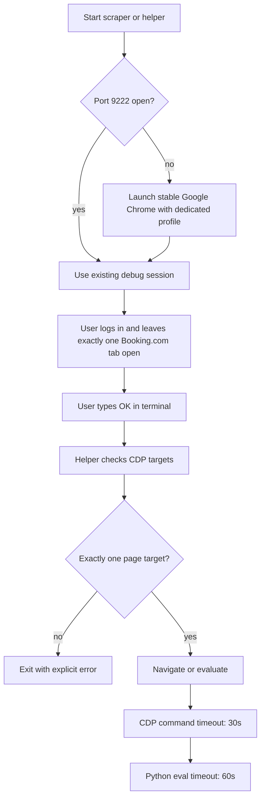

# Chrome Scrape Control

## Overview

This skill connects to Google Chrome through the native Chrome DevTools Protocol on port `9222` and reuses the user-owned logged-in session.

Hard rules:

- Use stable Google Chrome, not Chrome Beta.
- Use one foreground terminal session only.
- Do not use browser tools, subagents, timers, monitors, or watcher loops around scraper runs.
- The user owns tab readiness: log in, leave exactly one Booking.com tab open, then confirm in the terminal.
- The helper refuses to proceed unless CDP exposes exactly one `type === "page"` target.

## Launch Command

```bash
"/Applications/Google Chrome.app/Contents/MacOS/Google Chrome" --remote-debugging-port=9222 --user-data-dir="./chrome-profile" "https://www.booking.com"
```

## Workflow



## Helper Files

1. [cdp_helper.js](/Users/krz/Dev/holidai/chrome-scrape-control/cdp_helper.js)
   - navigates the active Booking.com tab
   - evaluates JavaScript in that tab
   - rejects zero-page and multi-page target states
   - times out CDP commands after 30 seconds
2. [chrome_control.py](/Users/krz/Dev/holidai/chrome-scrape-control/chrome_control.py)
   - ensures stable Google Chrome is running on port `9222`
   - launches a dedicated profile when needed
   - enforces timeout-aware `eval` subprocess calls

## Terminal Examples

```bash
# Navigate the single active Booking.com tab
node chrome-scrape-control/cdp_helper.js navigate "https://www.booking.com"

# Evaluate JavaScript in that tab
node chrome-scrape-control/cdp_helper.js eval "() => ({ title: document.title, url: window.location.href })"
```

```python
import sys
import importlib.util

spec = importlib.util.spec_from_file_location(
    "chrome_control",
    "chrome-scrape-control/chrome_control.py",
)
chrome_control = importlib.util.module_from_spec(spec)
sys.modules["chrome_control"] = chrome_control
spec.loader.exec_module(chrome_control)

if chrome_control.ensure_browser(
    port=9222,
    profile_dir="scrape/chrome-profile",
    default_url="https://www.booking.com",
    login_prompt="Confirm the stable Chrome scraper window is logged in and has exactly one Booking.com tab open.",
):
    ok, err = chrome_control.run_chrome_open("https://www.booking.com")
    if not ok:
        raise RuntimeError(err)

    result, err = chrome_control.run_chrome_eval("() => document.title", timeout=60)
    if err:
        raise RuntimeError(err)
    print(result)
```
