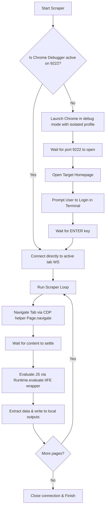

# Chrome Scrape Control

## Overview
This skill provides a highly reliable and lightweight browser automation framework utilizing Google Chrome's native Chrome DevTools Protocol (CDP) over WebSockets. Unlike standard automation suites (which launch headless, unauthenticated browsers or spawn multiple headed windows that trigger security alerts), this framework connects to a headed Chrome instance (stable or Beta) with a dedicated profile and navigates **strictly inside a single active tab**, preserving cookies and active logins (e.g. Booking.com, Google).

## Workflow



## Quick Reference

To launch Chrome with the required debugging port and isolated profile:
```bash
# macOS - Google Chrome Stable
"/Applications/Google Chrome.app/Contents/MacOS/Google Chrome" --remote-debugging-port=9222 --user-data-dir="./chrome-profile" "https://www.booking.com"

# macOS - Google Chrome Beta
"/Applications/Google Chrome Beta.app/Contents/MacOS/Google Chrome Beta" --remote-debugging-port=9222 --user-data-dir="./chrome-profile" "https://www.booking.com"
```

To run a navigation or evaluate command using the CDP helper:
```bash
# Navigate active tab to a new URL
node cdp_helper.js navigate "https://www.example.com"

# Evaluate JavaScript on the active tab and print JSON results
node cdp_helper.js eval "() => { return { title: document.title, url: window.location.href }; }"
```

## Implementation Details

The skill includes the following core components in the `chrome-scrape-control/` directory:

1. [cdp_helper.js](file:///Users/krz/Dev/holidai/chrome-scrape-control/cdp_helper.js) - A zero-dependency Node.js script using the native `WebSocket` API (Node 22+) to connect to Chrome on port 9222.
   - **`navigate` action:** Navigates the current tab directly via CDP `Page.navigate`.
   - **`eval` action:** Evaluates a JS string or function on the active tab via CDP `Runtime.evaluate`, automatically wrapping arrow function definitions in IIFEs `(async () => { ... })()` for execution.
2. [chrome_control.py](file:///Users/krz/Dev/holidai/chrome-scrape-control/chrome_control.py) - A reusable Python module containing helper functions to check/launch debugging Chrome with an isolated profile and run commands using `cdp_helper.js`.

### Reusable Code Templates

#### Python Integration Example (Direct Subprocess)
To call `cdp_helper.js` directly from any Python scraping script:
```python
import subprocess
import os

def navigate_tab(url):
    proc = subprocess.run(["node", "chrome-scrape-control/cdp_helper.js", "navigate", url], capture_output=True, text=True)
    return proc.returncode == 0

def eval_in_tab(js_code):
    proc = subprocess.Popen(["node", "chrome-scrape-control/cdp_helper.js", "eval"], stdin=subprocess.PIPE, stdout=subprocess.PIPE, stderr=subprocess.PIPE, text=True)
    stdout, stderr = proc.communicate(input=js_code)
    if proc.returncode == 0:
        return stdout.strip()
    return None
```

#### Python Integration Example (Using `chrome_control.py`)
To use the helper module (resolving the hyphen in the package directory path dynamically):
```python
import sys
import importlib.util

# Dynamically import chrome_control.py from the hyphenated directory
spec = importlib.util.spec_from_file_location("chrome_control", "chrome-scrape-control/chrome_control.py")
chrome_control = importlib.util.module_from_spec(spec)
sys.modules["chrome_control"] = chrome_control
spec.loader.exec_module(chrome_control)

# 1. Ensure browser is open on port 9222 with an isolated profile
success = chrome_control.ensure_browser(
    port=9222,
    profile_dir="scrape/chrome-profile",
    default_url="https://www.booking.com",
    login_prompt="Please log in to Booking.com in the browser."
)

if success:
    # 2. Navigate tab
    chrome_control.run_chrome_open("https://www.booking.com")
    
    # 3. Evaluate JavaScript
    result, err = chrome_control.run_chrome_eval("() => document.title")
    print("Page Title:", result)
```
